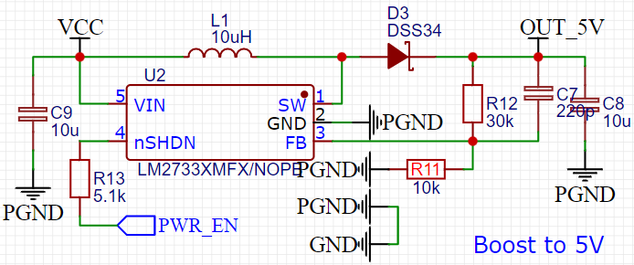

# EE USB Battery Power Management

## Introduction

This is a straightforward open-source hardware project, USB-BATTERY, designed for low-power applications with a battery. It features dual power supply capabilities, including battery supply and charging, as well as advanced low-power management.

## User Mannal

As shown in the figure above, the USB-BATTERY is a compact power module that can be mounted onto a breadboard. Below is the definition of the blocks or ports of the module:

1. **PWE_1**: Power Input 1 with USB TYPE C socket (Support PD Charging);
2. **PWR_2**: Power Input 2 with 2.54mm Header;
3. **IO_BAT**: The IO_BAT Port is used for power on/off and battery connection. The pin is defined as following "IO|GND|GND|BAT";
4. **OUT**: 5v and 3v3 power output;
5. **IO_KEY**: Turn On/Off of power output(active low);
6. **IND**: LED indicators with "PWR","CHG", and "STD";
   * **PWR**: ON-Power output Enable; OFF-Power Output Disable;
   * **CHG**: ON-Battery is charging; OFF-Battery missing or charged;
   * **STD**: ON-Battery is charged or missed;

## Schematic

The following link is schematic(.pdf) for the project.
[USB_Battery_PM_Schematic](./SourceFile/Schematic_USB_BAT_PM_V1.pdf)

### PWR_1

R1 and R2 are used for PD Charging identification;

### PWR_2

Power input port 2 with reverse connection protection;

### Power MUX

Power Multiplex which guarteen only one power supply input vaild at the same time;

### ON/OFF Control

Low Power Switch Control which is triggered by the falling edge of Enable siganl.

### Boost Converter

Boost the voltage to 5V with battery supply.

### Battery Charger

Linear Battery Charger;

## BOM

The following link is BOM(.csv) for the project.
[USB_Battery_PM_BOM](./Sourcefile/BOM_USB_BAT_PM_V1.csv)

## PCB Layout

The following link is PCB Layout(.pdf) for the project.
[USB_Battery_PM_PCBlayout](./SourceFile/PCB_PCB_USB_BAT_PM_V1.pdf)

## Performance

* Quiescent Current: 90uA;
* Battery Charging Current: 390mA;
* Maximum Output Current @5V    : 1.5A;
* Maxumum Output Current @3.3V  : 300 mA;

## License

The project follows MIT Open-Source License;